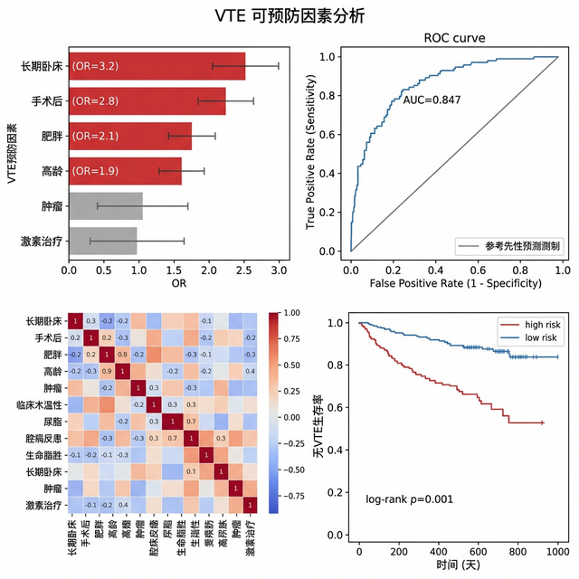

# VTE（静脉血栓栓塞）潜在可预防因素分析

## 研究概述

本项目对 **312例VTE患者** 进行回顾性分析，探索潜在可预防VTE的独立影响因素，并构建机器学习预测模型。以2025年3月31日为界，将数据分为两个时期进行对比分析。

- **3-31前**：224例（训练集179例 + 测试集45例）
- **3-31后**：88例（外部验证集）
- **目标变量**：潜在可预防VTE（阳性率：前45.5%，后71.6%）


### 分析结果可视化



## 分析内容

### 1. Logistic回归分析

| 分析 | 样本量 | 目标变量 | 显著变量数 |
|------|--------|----------|-----------|
| 3-31前总体 | 224 | 潜在可预防VTE | 2个 |
| 3-31后总体 | 88 | 潜在可预防VTE | 1个 |
| 3-31前 HA-VTE=1 | 153 | 规范预防 | 3个 |
| 3-31后 HA-VTE=1 | 32 | 规范预防 | 1个 |

每组分析包含：基线特征（描述性统计）、单因素Logistic回归、多因素Logistic回归（含VIF共线性检验）。

### 2. 机器学习预测

6种模型对比（训练集采用10折交叉验证）：

| 模型 | 训练集AUC(10折CV) | 测试集AUC |
|------|:---------:|:--------:|
| XGBoost | 0.934 | 0.906 |
| Decision Tree | 0.873 | 0.828 |
| Random Forest | 0.862 | 0.802 |
| SVM | 0.776 | 0.546 |
| Naive Bayes | 0.560 | 0.595 |
| KNN | 0.550 | 0.506 |

SHAP可解释性分析Top5特征：90天前是否我院就诊、VTE诊断与入院>24h、VTE确诊日期差值、出血风险评估、感染史。

### 3. 前后对比

| 指标 | 3-31前 | 3-31后 | P值 |
|------|--------|--------|-----|
| 医院相关性VTE | 153/224 (68.3%) | 32/88 (36.4%) | <0.001 |
| 潜在可预防VTE在HA-VTE中占比 | 102/153 (66.7%) | 27/32 (84.4%) | 0.077 |
| 规范预防率 | 15/102 (14.7%) | 9/63 (14.3%) | 1.000 |

## 数据泄漏处理

已排除76个预防相关泄漏变量（医院相关性VTE、规范预防、是否药物/机械预防、预防措施哑变量、预防时间差值等），确保回归和ML分析不受定义性变量污染。基线表保留这些变量用于描述性展示。

## 项目结构

### 核心脚本

| 脚本 | 功能 |
|------|------|
| `06_comprehensive_analysis.py` | 主分析脚本：基线、单因素、多因素（含VIF）、对比表、描述性统计 |
| `07_ml_analysis.py` | 机器学习：6模型训练(10折CV)、SHAP、外部验证、可视化 |
| `17_report_v3.py` | 自动生成Word报告（27表16图） |
| `01_data_preprocessing.py` | 数据预处理、训练/测试集划分 |

### 辅助脚本

| 脚本 | 功能 |
|------|------|
| `02_python_baseline.py` | 早期基线分析（已被06替代） |
| `03_python_logistic.py` | 早期Logistic回归（已被06替代） |
| `04_R_analysis.R` | R语言验证分析 |
| `05_spss_prepare.py` | SPSS语法文件生成 |
| `08_r_validation.R` / `10_r_ml_full.R` | R语言ML交叉验证 |

### 输出文件（当前有效版本）

**Logistic回归结果：**
- `overall_before_baseline/univariate/multivariate.csv` — 3-31前224例
- `overall_after_baseline/univariate/multivariate.csv` — 3-31后88例
- `havte_before_baseline/univariate/multivariate.csv` — HA-VTE前153例（目标：规范预防）
- `havte_after_baseline/univariate/multivariate.csv` — HA-VTE后32例（目标：规范预防）

**对比与描述统计：**
- `compare_before_after_v2.csv` — 前后对比表（含总例数列）
- `descriptive_before.csv` / `descriptive_after.csv` — 变量描述性统计

**机器学习结果：**
- `ml_train_test_comparison.csv` — 各模型训练/测试性能
- `ml_model_comparison.csv` — 模型间测试集对比
- `shap_features.csv` — SHAP特征重要性
- `risk_factors_summary.csv` — 危险因素汇总（单因素+多因素+SHAP）
- `external_validation_results.csv` — 外部验证结果

**可视化：**
- `roc_comparison.png` / `roc_train.png` — ROC曲线对比
- `cm_*.png` — 各模型混淆矩阵（训练+测试并排）
- `roc_*.png` — 各模型单独ROC曲线
- `shap_summary.png` / `shap_importance.png` — SHAP可解释性
- `forest_plot.png` — 多因素森林图

**报告：**
- `VTE影响因素分析报告.docx` — 完整分析报告（27表16图）

### 数据源

- `final_processed_data_full_pipeline.csv` — 唯一原始数据源（312例）
- `train_data.csv` (179例) / `test_data.csv` (45例) / `external_validation_data.csv` (88例)

## 统计方法

- **基线分析**：正态分布连续变量用t检验，非正态用Mann-Whitney U检验；分类变量用卡方检验/Fisher精确检验
- **单因素分析**：逐变量二元Logistic回归
- **多因素分析**：共线性检查（r>0.8剔除）→ EPV原则约束变量数 → Logistic回归 → VIF检验
- **机器学习**：10折分层交叉验证评估训练性能，独立测试集验证，SHAP可解释性分析

## 环境依赖

```
Python 3.12+
pandas, numpy, scipy, statsmodels
scikit-learn, xgboost, shap
matplotlib, python-docx
```

## 数据预处理说明

1. 极端值住院天数（-8天）修正为8天
2. 缺失机械预防日期差值创建"_无"指示变量并填充0
3. 删除常量列
4. 排除76个预防相关泄漏变量（回归和ML分析中）
5. SVM和KNN使用StandardScaler标准化
